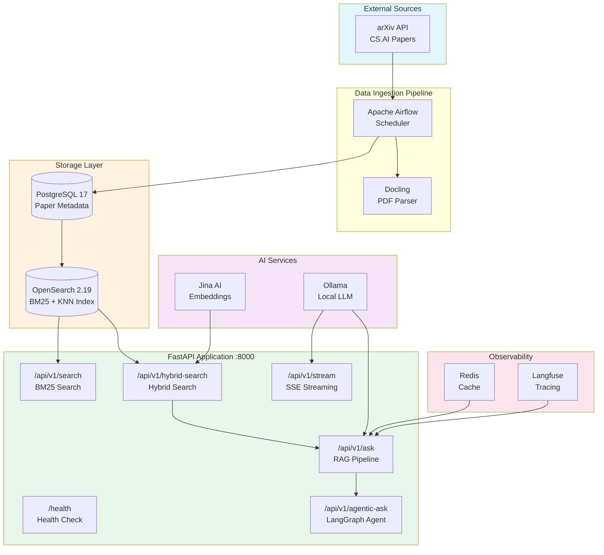
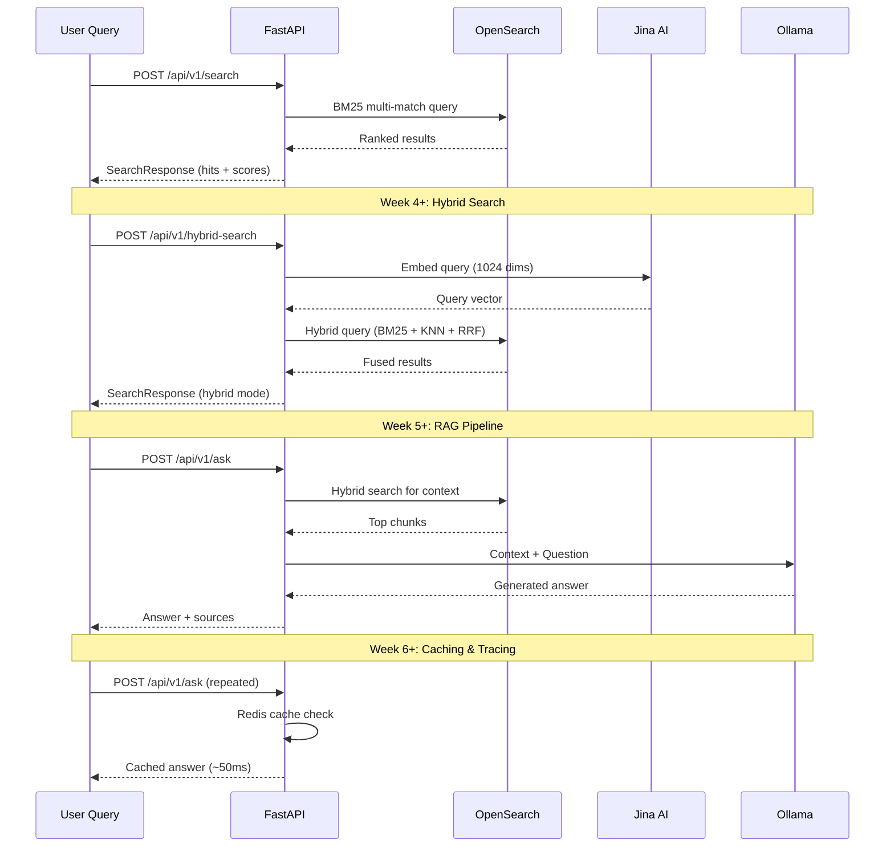
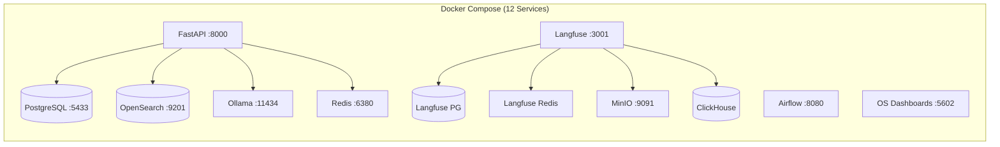
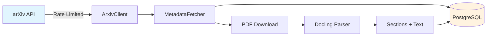
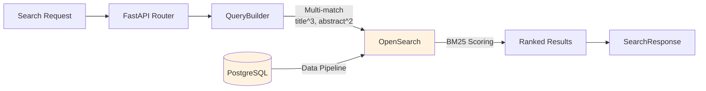
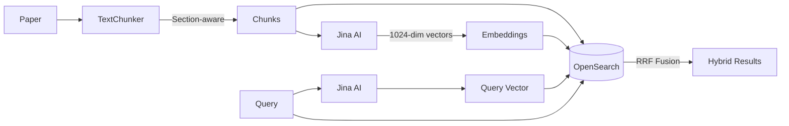
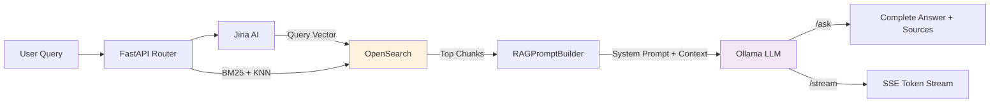
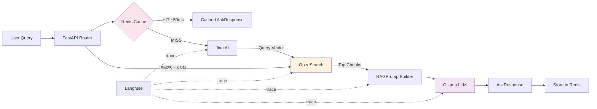
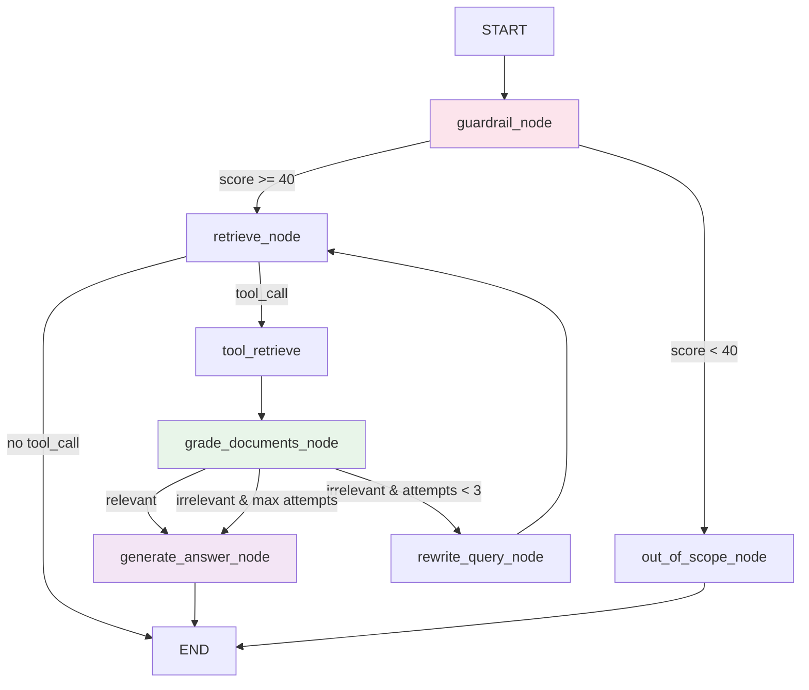

# PaperAlchemy

## Transform Academic Papers into Knowledge Gold

<div align="center">
  <h3>A Production-Grade RAG System for Academic Research</h3>
  <p>Build a complete Retrieval-Augmented Generation pipeline — from infrastructure to agentic AI</p>
  <p>Master the most in-demand AI engineering skill: <strong>RAG (Retrieval-Augmented Generation)</strong></p>
</div>

<p align="center">
  
  
  
  
  
  
  
</p>

---

## About This Project

PaperAlchemy is a **learner-focused project** where you build a complete research assistant that automatically fetches academic papers, understands their content, and answers research questions using advanced RAG techniques.

Unlike tutorials that jump straight to vector search, PaperAlchemy follows the **professional path**: master keyword search foundations first, then enhance with vectors for hybrid retrieval.

> **The Professional Difference:** We build RAG systems the way successful companies do — solid search foundations enhanced with AI, not AI-first approaches that ignore search fundamentals.

---

## System Architecture



### Data Flow



---

## Weekly Learning Path

| Week | Topic | Status | Key Components |
|------|-------|--------|----------------|
| **Week 1** | Infrastructure Foundation | ✅ Complete | Docker Compose, FastAPI, PostgreSQL, OpenSearch, Airflow, Ollama |
| **Week 2** | Data Ingestion Pipeline | ✅ Complete | arXiv API, Docling PDF parser, SQLAlchemy ORM, Repository pattern |
| **Week 3** | Keyword Search (BM25) | ✅ Complete | OpenSearch indexing, QueryBuilder, Search API, Custom analyzers |
| **Week 4** | Chunking & Hybrid Search | ✅ Complete | Section-aware chunking, Jina embeddings, RRF fusion, Hybrid search API |
| **Week 5** | Complete RAG Pipeline | ✅ Complete | Ollama LLM, RAG prompt engineering, SSE streaming, `/ask` + `/stream` endpoints |
| **Week 6** | Production Monitoring & Caching | ✅ Complete | Redis caching (150-400x speedup), Langfuse tracing, graceful degradation |
| **Week 7** | Agentic RAG | ✅ Complete | LangGraph StateGraph, Guardrail node, Adaptive retrieval, Gradio UI |

---

## Quick Start

### Prerequisites

- **Docker Desktop** (with Docker Compose v2)
- **Python 3.12+**
- **UV Package Manager** ([Install Guide](https://docs.astral.sh/uv/getting-started/installation/))
- **8GB+ RAM**, 20GB+ free disk space

### Installation

```bash
# 1. Clone the repository
git clone https://github.com/nishantgaurav23/PaperAlchemy.git
cd PaperAlchemy

# 2. Configure environment
cp .env.example .env
# Edit .env with your settings (defaults work for local dev)

# 3. Install Python dependencies
uv sync

# 4. Start all services
docker compose up --build -d

# 5. Verify health
curl http://localhost:8000/health
```

### Running Notebooks

```bash
# Start Jupyter with UV environment
uv run jupyter lab notebooks/

# Week-specific notebooks:
uv run jupyter lab notebooks/week1/week1_setup.ipynb
uv run jupyter lab notebooks/week2/week2_arxiv_integration.ipynb
uv run jupyter lab notebooks/week3/week3_opensearch.ipynb
uv run jupyter lab notebooks/week4/week4_hybrid_search.ipynb
uv run jupyter lab notebooks/week5/week5_complete_rag_system.ipynb
uv run jupyter lab notebooks/week6/week6_caching_and_tracing.ipynb
```

---

## Week 1: Infrastructure Foundation ✅

### Learning Objectives
- Docker Compose orchestration with 12 services
- FastAPI with health checks and automatic documentation
- PostgreSQL database setup and management
- OpenSearch cluster configuration
- Service health monitoring

### Architecture



**Notebook:** [notebooks/week1/week1_setup.ipynb](notebooks/week1/week1_setup.ipynb)

---

## Week 2: Data Ingestion Pipeline ✅

### Learning Objectives
- arXiv API integration with rate limiting (3s delay) and retry logic
- Scientific PDF parsing with Docling
- SQLAlchemy ORM models and Repository pattern
- Pydantic schemas for data validation
- Factory pattern for service creation

### Architecture



**Key Components:**
- `src/services/arxiv/client.py` — Rate-limited arXiv API client
- `src/services/pdf_parser/service.py` — Docling PDF extraction
- `src/repositories/paper.py` — Paper CRUD with Repository pattern

**Notebook:** [notebooks/week2/week2_arxiv_integration.ipynb](notebooks/week2/week2_arxiv_integration.ipynb)

---

## Week 3: Keyword Search (BM25) ✅

### Learning Objectives
- OpenSearch index management with custom analyzers (text_analyzer with snowball stemming)
- BM25 scoring algorithm and multi-field search with boosting
- QueryBuilder pattern for constructing complex queries
- Search API with GET/POST endpoints, filtering, and pagination
- Strict dynamic mapping to prevent indexing errors

### Architecture



**Key Components:**
- `src/services/opensearch/client.py` — Unified OpenSearch client (BM25, vector, hybrid)
- `src/services/opensearch/query_builder.py` — Query construction with field boosting
- `src/services/opensearch/index_config.py` — Index mappings, analyzers, RRF pipeline
- `src/routers/search.py` — GET/POST search endpoints
- `src/routers/ping.py` — Health check with per-service status

**Notebook:** [notebooks/week3/week3_opensearch.ipynb](notebooks/week3/week3_opensearch.ipynb)

---

## Week 4: Chunking & Hybrid Search ✅

### Learning Objectives
- Section-based document chunking with overlap strategies (600 words, 100 overlap)
- Jina AI embeddings (1024-dim vectors, asymmetric encoding: `retrieval.passage` / `retrieval.query`)
- Hybrid search: BM25 + KNN vector search with RRF (Reciprocal Rank Fusion) pipeline
- Unified search API supporting multiple search modes with graceful degradation
- Factory pattern for service wiring

### Architecture



**Key Components:**
- `src/services/indexing/text_chunker.py` — Section-aware chunking with configurable overlap
- `src/services/indexing/hybrid_indexer.py` — End-to-end pipeline: chunk → embed → index
- `src/services/indexing/factory.py` — Factory wiring TextChunker + Jina + OpenSearch
- `src/services/embeddings/jina_client.py` — Jina AI embedding client (async, batched)
- `src/services/embeddings/factory.py` — Embeddings client factory
- `src/schemas/indexing/models.py` — ChunkMetadata and TextChunk data models
- `src/schemas/api/search.py` — HybridSearchRequest with `use_hybrid` toggle
- `src/routers/hybrid_search.py` — POST `/api/v1/hybrid-search` with BM25 fallback

**Notebook:** [notebooks/week4/week4_hybrid_search.ipynb](notebooks/week4/week4_hybrid_search.ipynb)

---

## Week 5: Complete RAG Pipeline ✅

### Learning Objectives
- Ollama HTTP client for local LLM inference (health check, generate, stream)
- RAG prompt engineering with structured JSON output and citation extraction
- Response parsing fallback chain (JSON → regex → plain text)
- Server-Sent Events (SSE) streaming for real-time token output
- Factory pattern for service initialization and FastAPI lifespan integration
- 3-tier configuration: per-request → environment variable → code default
- Custom exception hierarchy for LLM error handling

### Architecture



**Key Components:**
- `src/services/ollama/client.py` — Ollama HTTP client (generate, stream, RAG)
- `src/services/ollama/prompts.py` — RAGPromptBuilder + ResponseParser
- `src/services/ollama/prompts/rag_system.txt` — System prompt template
- `src/services/ollama/factory.py` — `make_ollama_client()` factory
- `src/routers/ask.py` — `/api/v1/ask` (standard) + `/api/v1/stream` (SSE)
- `src/schemas/api/ask.py` — AskRequest/AskResponse models
- `src/schemas/ollama.py` — RAGResponse (structured LLM output schema)

**Notebook:** [notebooks/week5/week5_complete_rag_system.ipynb](notebooks/week5/week5_complete_rag_system.ipynb)

---

## Week 6: Production Monitoring & Caching ✅

### Learning Objectives
- Redis exact-match caching with SHA256 key generation and configurable TTL
- Langfuse tracing for per-stage RAG pipeline observability (embed, search, prompt, generate)
- Graceful degradation: cache/tracing failures never break the pipeline
- Factory pattern for Redis and Langfuse client initialization
- Cache-aware endpoints with early return on hit (150-400x speedup)

### Architecture



```
User Question
     │
     ▼
Cache Check ──[HIT]──► Instant Response (~50ms)
     │ [MISS]
     ▼
Embed (Jina) → Search (OpenSearch) → Prompt → Generate (Ollama)
     │                    │                         │
     │         [Langfuse spans per stage]           │
     ▼                                              ▼
Store in Redis ◄─────────────────────── AskResponse
     │
     ▼
Return to User
```

**Key Components:**
- `src/services/cache/client.py` — CacheClient with SHA256 key generation, async GET/SET
- `src/services/cache/factory.py` — `make_cache_client()` with Redis ping test
- `src/services/langfuse/client.py` — LangfuseTracer wrapping Langfuse SDK
- `src/services/langfuse/tracer.py` — RAGTracer with per-stage tracing methods
- `src/services/langfuse/factory.py` — `make_langfuse_tracer()` with graceful disabled mode
- `src/routers/ask.py` — Cache check/store + Langfuse spans in `/ask` and `/stream`
- `src/config.py` — RedisSettings (TTL, timeouts) + LangfuseSettings (keys, flush config)
- `src/dependency.py` — CacheDep + LangfuseDep type aliases

**Notebook:** [notebooks/week6/week6_caching_and_tracing.ipynb](notebooks/week6/week6_caching_and_tracing.ipynb)

---

## Week 7: Agentic RAG ✅

### Learning Objectives
- LangGraph `StateGraph` with typed context injection (`Runtime[Context]`) for dependency-free nodes
- Guardrail node: domain scoring via LLM to reject off-topic queries before retrieval
- Adaptive retrieval: grade documents → rewrite query → retry (up to 3 attempts)
- Tool-calling pattern: `retrieve_papers` as a LangChain tool executed by `ToolNode`
- `tools_condition` routing: LLM decides whether to call a tool or terminate
- Gradio UI: two-tab interface for Standard RAG (streaming) and Agentic RAG (blocking)

### LangGraph Pipeline



**Key Components:**
- `src/services/agents/agentic_rag.py` — `AgenticRAGService`: compiles graph, runs workflow, extracts sources
- `src/services/agents/factory.py` — `make_agentic_rag_service()` factory
- `src/services/agents/state.py` — `AgentState` (TypedDict) + `Context` (typed DI container)
- `src/services/agents/models.py` — `SourceItem`, `ReasoningStep`, `ToolArtefact`
- `src/services/agents/config.py` — `GraphConfig` (top_k, use_hybrid, thresholds)
- `src/services/agents/tools.py` — `retrieve_papers` LangChain tool
- `src/services/agents/prompts.py` — Prompt templates for all 4 LLM-calling nodes
- `src/services/agents/nodes/guardrail_node.py` — Domain scoring (reject non-CS/AI queries)
- `src/services/agents/nodes/retrieve_node.py` — Calls `retrieve_papers` tool via LLM tool-call
- `src/services/agents/nodes/grade_documents_node.py` — Binary relevance grading per chunk
- `src/services/agents/nodes/rewrite_query_node.py` — Query rewriting for retry
- `src/services/agents/nodes/generate_answer_node.py` — Final answer generation with citations
- `src/services/agents/nodes/out_of_scope_node.py` — Polite rejection for off-topic queries
- `src/services/agents/nodes/utils.py` — Shared message-parsing helpers across all nodes
- `src/routers/agentic.py` — `POST /api/v1/ask-agentic` endpoint
- `src/schemas/api/agentic.py` — `AgenticAskRequest` / `AgenticAskResponse`
- `src/gradio_app.py` — Gradio Blocks UI (Standard RAG + Agentic RAG tabs)
- `gradio_launcher.py` — Root-level launcher (`make gradio`)

---

## Tech Stack

| Component | Technology | Version | Purpose |
|-----------|------------|---------|---------|
| **API Framework** | FastAPI | 0.115+ | REST API with async support |
| **Database** | PostgreSQL | 17 | Paper metadata storage |
| **Search Engine** | OpenSearch | 2.19 | Hybrid search (BM25 + Vector) |
| **Workflow** | Apache Airflow | 2.10 | Data pipeline orchestration |
| **LLM** | Ollama | Latest | Local LLM serving |
| **Embeddings** | Jina AI | v3 | 1024-dim vector embeddings |
| **Cache** | Redis | 7+ | Query caching |
| **Monitoring** | Langfuse | 3 | RAG pipeline tracing |
| **PDF Parser** | Docling | Latest | Scientific PDF extraction |
| **UI** | Gradio | Latest | Interactive chat interface |

**Development Tools:** UV, Docker Compose, Jupyter

---

## Project Structure

```
PaperAlchemy/
├── src/                          # Main application code
│   ├── config.py                 # Centralized config (Pydantic Settings)
│   ├── main.py                   # FastAPI app with lifespan manager
│   ├── dependency.py             # Dependency injection (Annotated types)
│   ├── exceptions.py             # Custom exception hierarchy
│   ├── middlewares.py            # Request logging helpers
│   ├── db/                       # Database layer
│   │   ├── database.py           # SQLAlchemy engine & session management
│   │   └── factory.py            # Database factory
│   ├── models/                   # SQLAlchemy ORM models
│   │   ├── base.py               # Base model with timestamps
│   │   └── paper.py              # Paper model (JSONB for sections)
│   ├── schemas/                  # Pydantic validation schemas
│   │   ├── api/                  # API request/response schemas
│   │   │   ├── health.py         # ServiceStatus, HealthResponse
│   │   │   ├── search.py         # SearchRequest, HybridSearchRequest, SearchResponse
│   │   │   └── ask.py            # AskRequest, AskResponse
│   │   ├── ollama.py             # RAGResponse (structured LLM output)
│   │   ├── indexing/             # Indexing pipeline schemas
│   │   │   └── models.py         # ChunkMetadata, TextChunk
│   │   └── arxiv/                # arXiv paper schemas
│   ├── repositories/             # Data access layer (Repository pattern)
│   │   └── paper.py              # Paper CRUD operations
│   ├── services/                 # Business logic services
│   │   ├── arxiv/                # arXiv API client + factory
│   │   ├── pdf_parser/           # Docling PDF parser + factory
│   │   ├── embeddings/           # Jina AI embeddings
│   │   │   ├── jina_client.py    # Async Jina embedding client
│   │   │   └── factory.py        # Embeddings service factory
│   │   ├── indexing/             # Chunking & indexing pipeline
│   │   │   ├── text_chunker.py   # Section-aware text chunker
│   │   │   ├── hybrid_indexer.py # Chunk → embed → index pipeline
│   │   │   └── factory.py        # Indexing service factory
│   │   ├── opensearch/           # OpenSearch client, query builder, config
│   │   │   ├── client.py         # Unified search client (BM25/vector/hybrid)
│   │   │   ├── query_builder.py  # Query construction with field boosting
│   │   │   ├── index_config.py   # Index mappings + RRF pipeline
│   │   │   └── factory.py        # Client factory (cached + fresh)
│   │   ├── ollama/               # Ollama LLM service
│   │   │   ├── client.py         # HTTP client (generate, stream, RAG)
│   │   │   ├── prompts.py        # RAGPromptBuilder + ResponseParser
│   │   │   ├── prompts/          # Prompt templates
│   │   │   │   └── rag_system.txt
│   │   │   └── factory.py        # make_ollama_client() factory
│   │   ├── cache/                # Redis caching service
│   │   │   ├── client.py         # CacheClient (SHA256 keys, async GET/SET)
│   │   │   └── factory.py        # make_cache_client() + make_redis_client()
│   │   ├── langfuse/             # Langfuse tracing service
│   │   │   ├── client.py         # LangfuseTracer (SDK wrapper)
│   │   │   ├── tracer.py         # RAGTracer (per-stage tracing)
│   │   │   └── factory.py        # make_langfuse_tracer()
│   │   └── agents/               # Agentic RAG (Week 7)
│   │       ├── agentic_rag.py    # AgenticRAGService (LangGraph orchestrator)
│   │       ├── factory.py        # make_agentic_rag_service()
│   │       ├── state.py          # AgentState TypedDict + Context DI container
│   │       ├── models.py         # SourceItem, ReasoningStep, ToolArtefact
│   │       ├── config.py         # GraphConfig (top_k, thresholds)
│   │       ├── tools.py          # retrieve_papers LangChain tool
│   │       ├── prompts.py        # Prompt templates for all nodes
│   │       └── nodes/            # Individual LangGraph nodes
│   │           ├── guardrail_node.py     # Domain scoring + reject off-topic
│   │           ├── retrieve_node.py      # Tool-calling retrieval node
│   │           ├── grade_documents_node.py # Binary relevance grading
│   │           ├── rewrite_query_node.py   # Query rewriting for retry
│   │           ├── generate_answer_node.py # Final answer generation
│   │           ├── out_of_scope_node.py    # Polite rejection node
│   │           └── utils.py              # Shared message-parsing helpers
│   ├── gradio_app.py             # Gradio UI (Standard RAG + Agentic RAG tabs)
│   └── routers/                  # API route handlers
│       ├── ping.py               # /api/v1/health with service checks
│       ├── search.py             # /api/v1/search GET + POST
│       ├── hybrid_search.py      # /api/v1/hybrid-search POST
│       ├── ask.py                # /api/v1/ask + /api/v1/stream (RAG)
│       └── agentic.py            # /api/v1/ask-agentic (Agentic RAG)
├── notebooks/                    # Weekly learning notebooks
│   ├── week1/                    # Infrastructure setup
│   ├── week2/                    # arXiv integration & PDF parsing
│   ├── week3/                    # BM25 keyword search
│   ├── week4/                    # Chunking & hybrid search
│   ├── week5/                    # Complete RAG pipeline with LLM
│   ├── week6/                    # Redis caching & Langfuse tracing
│   └── week7/                    # Agentic RAG with LangGraph
├── gradio_launcher.py            # Gradio UI launcher (make gradio)
├── compose.yml                   # Docker services (12 containers)
├── Dockerfile                    # Application container
├── pyproject.toml                # Python dependencies (UV)
└── README.md                     # This file
```

---

## Service Access Points

| Service | URL | Credentials |
|---------|-----|-------------|
| **Gradio UI** | http://localhost:7861 | `make gradio` |
| **FastAPI Docs** | http://localhost:8000/docs | — |
| **FastAPI Health** | http://localhost:8000/health | — |
| **API Health (detailed)** | http://localhost:8000/api/v1/health | — |
| **Airflow UI** | http://localhost:8080 | See generated credentials |
| **OpenSearch Dashboards** | http://localhost:5602 | No auth |
| **Langfuse** | http://localhost:3001 | Setup on first visit |
| **Ollama API** | http://localhost:11434 | — |
| **PostgreSQL** | localhost:5433 | `paperalchemy` / `paperalchemy_secret` |
| **Redis** | localhost:6380 | — |
| **OpenSearch API** | http://localhost:9201 | No auth |

---

## API Endpoints

| Endpoint | Method | Description | Week |
|----------|--------|-------------|------|
| `/health` | GET | Simple health check (Docker) | 1 |
| `/api/v1/health` | GET | Detailed service health | 3 |
| `/api/v1/search` | GET | BM25 keyword search (query params) | 3 |
| `/api/v1/search` | POST | BM25 search (JSON body with filters) | 3 |
| `/api/v1/hybrid-search` | POST | Hybrid BM25 + vector search | 4 |
| `/api/v1/ask` | POST | RAG question answering | 5 |
| `/api/v1/stream` | POST | Streaming RAG responses | 5 |
| `/api/v1/ask-agentic` | POST | Agentic RAG with LangGraph | 7 |

**Interactive API docs:** http://localhost:8000/docs

---

## Configuration

All configuration uses environment variables with sensible defaults:

```bash
# PostgreSQL
POSTGRES__HOST=localhost
POSTGRES__PORT=5433
POSTGRES__DB=paperalchemy

# OpenSearch
OPENSEARCH__HOST=http://localhost:9201
OPENSEARCH__INDEX_NAME=arxiv-papers

# arXiv API
ARXIV__MAX_RESULTS=100
ARXIV__CATEGORY=cs.AI
ARXIV__RATE_LIMIT_DELAY=3.0

# Jina AI (required for Week 4+)
JINA_API_KEY=your-key-here

# Ollama
OLLAMA__HOST=localhost
OLLAMA__MODEL=llama3.2
```

See `.env.example` for all available options.

---

## Docker Services

PaperAlchemy runs **12 containerized services**:

```bash
docker compose ps              # View all services
docker compose logs -f api     # FastAPI logs
docker compose logs opensearch # OpenSearch logs
docker compose restart api     # Restart a service
```

| Container | Image | Purpose |
|-----------|-------|---------|
| `paperalchemy-api` | Custom (Dockerfile) | FastAPI application |
| `paperalchemy-postgres` | postgres:17 | Main database |
| `paperalchemy-opensearch` | opensearchproject/opensearch:2.19 | Search engine |
| `paperalchemy-airflow` | apache/airflow:2.10.4 | Workflow scheduler |
| `paperalchemy-ollama` | ollama/ollama | LLM server |
| `paperalchemy-redis` | redis:7-alpine | Caching |
| `paperalchemy-dashboards` | opensearch-dashboards | Search UI |
| `paperalchemy-langfuse` | langfuse/langfuse:3 | Observability |
| `paperalchemy-clickhouse` | clickhouse-server | Analytics (Langfuse) |
| `paperalchemy-langfuse-postgres` | postgres:17 | Langfuse database |
| `paperalchemy-langfuse-redis` | redis:7-alpine | Langfuse cache |
| `paperalchemy-langfuse-minio` | minio/minio | Langfuse storage |

---

## Make Commands

```bash
make start       # Start all services
make stop        # Stop all services
make restart     # Restart all services
make health      # Check service health
make logs        # View API logs
make gradio      # Start Gradio web UI (http://localhost:7861)
make test        # Run test suite
make clean       # Remove containers and volumes
```

---

## Troubleshooting

**Services not starting:**
```bash
docker system df              # Check Docker resources (need 8GB+ RAM)
docker compose logs           # View all service logs
```

**Database connection errors:**
```bash
docker compose ps postgres    # Verify PostgreSQL is running
docker compose logs postgres  # Check PostgreSQL logs
```

**OpenSearch not responding:**
```bash
# OpenSearch needs 30-60s to initialize
curl http://localhost:9201/_cluster/health
```

**API returning 404 on /api/v1/search:**
```bash
# Rebuild the API container after code changes
docker compose up --build --force-recreate -d api
```

---

## Author

**Nishant Gaurav** - [@nishantgaurav23](https://github.com/nishantgaurav23)

- Email: nishantgaurav23@gmail.com
- GitHub: [github.com/nishantgaurav23](https://github.com/nishantgaurav23)

---

## Acknowledgments

This project architecture is inspired by [arxiv-paper-curator](https://github.com/jamwithai/arxiv-paper-curator) by [Jam With AI](https://jamwithai.substack.com/).

---

## License

This project is licensed under the MIT License - see the [LICENSE](LICENSE) file for details.

---

<div align="center">
  <p><strong>PaperAlchemy</strong> — Transforming Academic Papers into Knowledge Gold</p>
  <p>Built by Nishant Gaurav</p>
</div>
