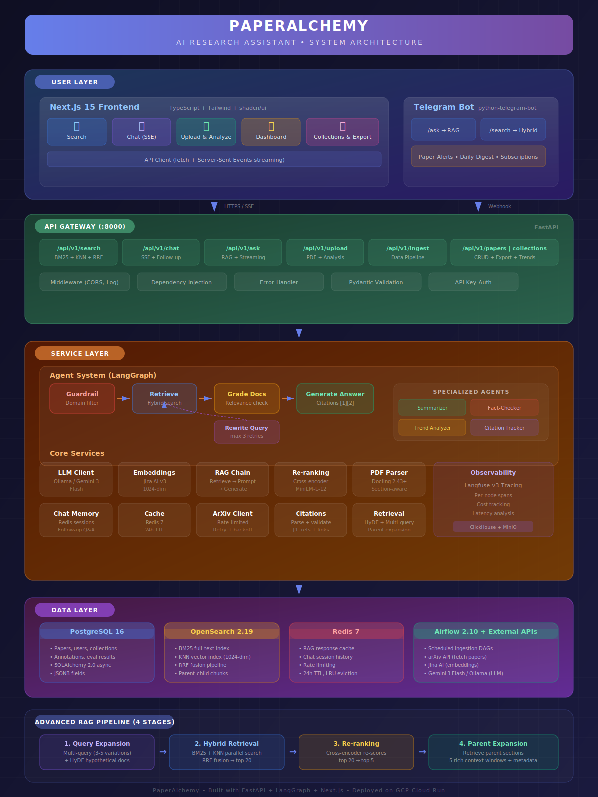

<p align="center">
  
</p>

<h1 align="center">PaperAlchemy</h1>

<p align="center">
  <strong>AI Research Assistant that answers questions with real paper citations</strong>
</p>

<p align="center">
  <a href="#features">Features</a> &bull;
  <a href="#tech-stack">Tech Stack</a> &bull;
  <a href="#architecture">Architecture</a> &bull;
  <a href="#getting-started">Getting Started</a> &bull;
  <a href="#api-endpoints">API</a> &bull;
  <a href="#development">Development</a> &bull;
  <a href="#roadmap">Roadmap</a>
</p>

<p align="center">
  
  
  
  
  
  
  
  
</p>

---

## What is PaperAlchemy?

PaperAlchemy is **not** a generic chatbot. It's a research assistant that:

- **Always searches its knowledge base** before answering any research question
- **Always cites papers** with title, authors, year, and arXiv link
- **Uses agentic RAG** with LangGraph state-machine agents and mandatory tool calls
- **Admits knowledge gaps** honestly when no relevant papers are found

```
You: "What is a transformer?"

PaperAlchemy:
  Transformers are a neural network architecture based on self-attention
  mechanisms, introduced by Vaswani et al. [1]. The key innovation is
  replacing recurrence with multi-head attention...

  Sources:
  1. Attention Is All You Need — Vaswani et al., 2017
     https://arxiv.org/abs/1706.03762
  2. BERT: Pre-training of Deep Bidirectional Transformers — Devlin et al., 2018
     https://arxiv.org/abs/1810.04805
```

---

## Features

### Research Assistant
- **Citation-first answers** — every response includes inline `[1][2]` references with arXiv links
- **Conversational follow-ups** — ask "What about its limitations?" and it re-retrieves with context
- **Session memory** — Redis-backed conversation history with 24h TTL

### Advanced RAG Pipeline (4 Stages)

| Stage | What it does | Output |
|-------|-------------|--------|
| **Query Expansion** | Multi-query (3-5 variations) + HyDE (hypothetical doc embeddings) | Expanded query set |
| **Hybrid Retrieval** | BM25 + KNN vector search + RRF fusion (parallel per query) | Top 20 chunks |
| **Re-ranking** | Cross-encoder (ms-marco-MiniLM-L-12-v2) re-scores candidates | Top 5 most relevant |
| **Parent Expansion** | Retrieves full parent sections for richer LLM context | 5 context windows |

### Multi-Agent System (LangGraph)
- **Guardrail Node** — filters off-topic queries (domain relevance scoring)
- **Retrieve Node** — mandatory tool calls to hybrid search (never answers from memory)
- **Grade Documents Node** — binary relevance scoring of retrieved papers
- **Rewrite Query Node** — up to 3 retries with synonym expansion and refinement
- **Generate Answer Node** — citation-enforcing generation with source validation
- **Specialized Agents** — Summarizer, Fact-Checker, Trend Analyzer, Citation Tracker

### Knowledge Base
- **Automated ingestion** via Apache Airflow DAGs (Mon-Fri 6am UTC)
- **arXiv API integration** with rate limiting and retry
- **Section-aware PDF parsing** via Docling (30-page limit)
- **Parent-child chunking** — small chunks (200w) for precision, parent sections (600w) for context

### Modern Frontend (Next.js 15)
- **Search** — hybrid search with category filters, sorting, and pagination
- **Chat** — SSE streaming chatbot with follow-up Q&A and citation rendering
- **Upload & Analyze** — drag-and-drop PDF upload with AI analysis
- **Dashboard** — research trends, hot papers, category breakdown
- **Collections** — reading lists, paper organization
- **Export** — BibTeX, Markdown, clipboard

### Additional
- **Telegram Bot** — mobile-first research assistant (`/ask`, `/search`, paper alerts)
- **Evaluation Framework** — RAGAS metrics + LLM judges + human eval UI
- **Observability** — Langfuse v3 per-node tracing with cost tracking
- **GCP Cloud Run** — scale-to-zero deployment ($0-7/mo)

---

## Tech Stack

| Layer | Technology | Why |
|-------|-----------|-----|
| **Backend** | Python 3.12 + FastAPI | Async, auto-docs, SSE streaming |
| **Frontend** | Next.js 15 + TypeScript + Tailwind + shadcn/ui | App Router, SSR, streaming |
| **Database** | PostgreSQL 16 + SQLAlchemy 2.0 | Async ORM, JSONB support |
| **Search** | OpenSearch 2.19 | BM25 + KNN hybrid in one engine |
| **Embeddings** | Jina AI v3 (1024-dim) | Free API, high quality |
| **Re-ranking** | Cross-encoder (ms-marco-MiniLM-L-12-v2) | Local, second-stage scoring |
| **LLM (local)** | Ollama (llama3.2) | Free local inference |
| **LLM (cloud)** | Google Gemini 3 Flash | Best cost/perf for research |
| **Agents** | LangGraph 0.2+ | State-machine agent graphs |
| **Caching** | Redis 7 | Sub-ms response cache, 24h TTL |
| **PDF Parsing** | Docling 2.43+ | Section-aware scientific PDFs |
| **Observability** | Langfuse v3 | LLM tracing + cost tracking |
| **Orchestration** | Apache Airflow 2.10 | Scheduled data ingestion |
| **Testing** | pytest + Vitest | Backend + frontend TDD |
| **Cloud** | GCP Cloud Run | Scale to zero, free tier |

---

## Architecture

<p align="center">
  
</p>

### System Layers

```
User Layer        Next.js 15 frontend + Telegram bot
    |
    | HTTPS / SSE
    v
API Gateway       FastAPI :8000 — routers, middleware, DI, validation
    |
    v
Service Layer     LangGraph agents + RAG chain + core services
    |
    v
Data Layer        PostgreSQL + OpenSearch + Redis + Airflow
```

### Agent Flow (Every Research Question)

```
Query --> [Guardrail] --> [Retrieve (mandatory tool call)] --> [Grade Docs]
                               ^                                  |
                               |                             relevant?
                          [Rewrite] <-- no (max 3) --------------|
                                                                  |
                                                                 yes
                                                                  v
                                                         [Generate Answer]
                                                         with citations [1][2]
```

---

## Getting Started

### Prerequisites

- **Docker Desktop** (4GB+ RAM allocated)
- **Python 3.12+** with [UV](https://docs.astral.sh/uv/)
- **Node.js 20+** with [pnpm](https://pnpm.io/)
- **Ollama** installed locally (for dev LLM)

### Quick Start

```bash
# 1. Clone
git clone https://github.com/nishantgaurav23/PaperAlchemy.git
cd PaperAlchemy

# 2. Configure
cp .env.example .env    # Edit with your API keys (JINA_API_KEY, GEMINI__API_KEY)

# 3. Start infrastructure
make start              # PostgreSQL, OpenSearch, Redis

# 4. Wait for healthy services
make health

# 5. Pull Ollama model (first time)
ollama pull llama3.2

# 6. Install Python deps
make setup              # uv sync

# 7. Start API server
make dev                # uvicorn on :8000

# 8. Start frontend (new terminal)
cd frontend && pnpm install && pnpm dev   # Next.js on :3000
```

### Key URLs

| Service | URL |
|---------|-----|
| API (Swagger docs) | http://localhost:8000/docs |
| Frontend | http://localhost:3000 |
| OpenSearch Dashboards | http://localhost:5602 |
| Airflow | http://localhost:8080 |
| pgAdmin | http://localhost:5050 |
| Langfuse | http://localhost:3001 |

---

## API Endpoints

| Method | Endpoint | Description |
|--------|----------|-------------|
| `GET` | `/health` | Health check |
| `POST` | `/api/v1/search` | Hybrid search (BM25 + KNN + RRF) |
| `POST` | `/api/v1/ask` | RAG question answering (JSON) |
| `POST` | `/api/v1/ask/stream` | Streaming RAG (SSE) |
| `POST` | `/api/v1/chat` | Conversational chat with follow-ups (SSE) |
| `POST` | `/api/v1/ingest/fetch` | Trigger paper ingestion |
| `POST` | `/api/v1/ingest/index` | Index papers into OpenSearch |
| `GET` | `/api/v1/papers` | List papers |
| `GET` | `/api/v1/papers/{id}` | Paper detail |

Full API docs available at `/docs` when running.

---

## Development

### Makefile Commands

```bash
make start      # Start Docker services (PostgreSQL, OpenSearch, Redis)
make stop       # Stop Docker services
make dev        # Start API server (hot reload)
make setup      # Install Python dependencies (uv sync)
make test       # Run all tests (pytest)
make test-cov   # Tests with coverage report
make lint       # Lint + type check (ruff)
make format     # Format code (ruff format)
make health     # Health check all services
make logs       # Tail service logs
make clean      # Remove containers + volumes + caches
```

### Spec-Driven Development

Every feature is built through a spec lifecycle:

```
/create-spec S{x}.{y} {slug}     -->  spec.md + checklist.md
/check-spec-deps S{x}.{y}        -->  verify prerequisites
/implement-spec S{x}.{y}         -->  TDD: Red -> Green -> Refactor
/verify-spec S{x}.{y}            -->  audit + notebook verification
```

Or run the full lifecycle at once:
```
/start-spec-dev S{x}.{y} {slug}  -->  create -> deps -> implement -> verify
```

### Testing

```bash
# Backend
pytest tests/ -v                        # All tests
pytest tests/unit/ -v                   # Unit tests only
pytest tests/unit/test_rag_chain.py -v  # Specific test

# Frontend
cd frontend && pnpm test               # Vitest
```

### Project Structure

```
PaperAlchemy/
├── src/                     # Python backend
│   ├── main.py              # FastAPI app
│   ├── config.py            # Pydantic settings
│   ├── routers/             # API endpoints
│   ├── models/              # SQLAlchemy ORM
│   ├── repositories/        # Data access
│   ├── schemas/             # Pydantic models
│   └── services/
│       ├── agents/          # LangGraph agentic RAG
│       │   ├── nodes/       # Guardrail, Retrieve, Grade, Rewrite, Generate
│       │   └── specialized/ # Summarizer, Fact-Checker, Trend, Citation
│       ├── rag/             # RAG chain + citation enforcement
│       ├── retrieval/       # HyDE, multi-query, pipeline
│       ├── reranking/       # Cross-encoder re-ranking
│       ├── embeddings/      # Jina AI client
│       ├── llm/             # Ollama + Gemini providers
│       ├── opensearch/      # Search client + queries
│       ├── chat/            # Conversation memory + follow-up
│       ├── cache/           # Redis caching
│       ├── arxiv/           # arXiv API client
│       ├── pdf_parser/      # Docling parser
│       └── indexing/        # Text chunking + parent-child
├── frontend/                # Next.js 15 app
│   └── src/
│       ├── app/             # App Router pages
│       ├── components/      # UI components
│       ├── lib/             # API client, utils
│       └── types/           # TypeScript types
├── tests/                   # pytest tests
├── specs/                   # Spec definitions
├── notebooks/specs/         # Per-spec Jupyter notebooks
├── airflow/dags/            # Ingestion DAGs
├── docs/                    # Architecture, ops guide
├── compose.yml              # Docker services
└── Makefile                 # Dev commands
```

---

## Roadmap

**46/65 specs completed** across 12 phases:

| Phase | Name | Status |
|-------|------|--------|
| P1 | Project Foundation | **4/4 done** |
| P2 | Backend Core | **4/4 done** |
| P3 | Data Layer | **4/4 done** |
| P4 | Search & Retrieval | **4/4 done** |
| P4b | Advanced RAG | **5/5 done** |
| P5 | RAG Pipeline | **5/5 done** |
| P6 | Agent System | **8/8 done** |
| P7 | Chatbot & Conversations | **3/3 done** |
| P8 | Paper Upload & Analysis | 0/5 |
| P9 | Frontend (Next.js) | **9/9 done** |
| P10 | Evaluation Framework | 0/5 |
| P11 | Observability & Deploy | 0/5 |
| P12 | Telegram Bot | 0/4 |

See [roadmap.md](roadmap.md) for full details.

---

## Environment Variables

```env
# Database
POSTGRES__HOST=localhost
POSTGRES__PORT=5433
POSTGRES__USER=paperalchemy
POSTGRES__PASSWORD=paperalchemy_secret
POSTGRES__DB=paperalchemy

# Search
OPENSEARCH__HOST=http://localhost:9201

# LLM
OLLAMA__HOST=localhost
OLLAMA__PORT=11434
OLLAMA__MODEL=llama3.2
GEMINI__API_KEY=your-key
GEMINI__MODEL=gemini-3-flash

# Embeddings
JINA_API_KEY=your-key

# Cache
REDIS__HOST=localhost
REDIS__PORT=6380
REDIS__TTL_HOURS=24

# Re-ranking
RERANKER__MODEL=cross-encoder/ms-marco-MiniLM-L-12-v2
RERANKER__TOP_K=5
```

---

## Deployment (GCP Cloud Run)

```
GCP Project
├── Cloud Run (API)         — scale 0-3, 1GB RAM
├── Cloud Run (Frontend)    — scale 0-2, 512MB RAM
├── Cloud SQL (PostgreSQL)  — smallest instance
├── Upstash Redis           — free tier
├── Cloud Storage           — PDFs + exports
└── Secret Manager          — API keys, DB creds

External:
├── Gemini 3 Flash API      — free tier (15 RPM)
├── Jina Embeddings API     — free tier (1M tokens/mo)
└── OpenSearch              — self-hosted or Aiven
```

**Estimated cost: $0-7/mo** with free tier usage.

---

## Author

**Nishant Gaurav** - [@nishantgaurav23](https://github.com/nishantgaurav23)

---

## Acknowledgments

Architecture inspired by [arxiv-paper-curator](https://github.com/jamwithai/arxiv-paper-curator) by [Jam With AI](https://jamwithai.substack.com/). Rebuilt from scratch with spec-driven TDD, advanced RAG, and a modern Next.js frontend.

---

## License

This project is for educational and research purposes.

---

<p align="center">
  Built with FastAPI + LangGraph + Next.js + OpenSearch
  <br/>
  <sub>Every answer grounded in real papers. Every citation linked to arXiv.</sub>
</p>
